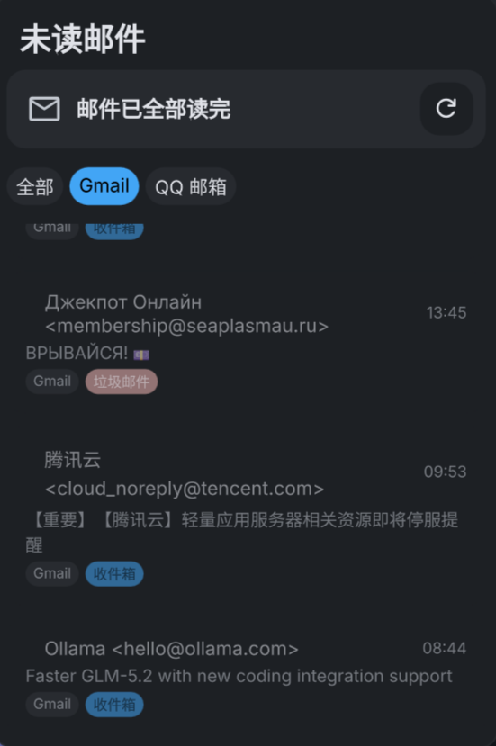
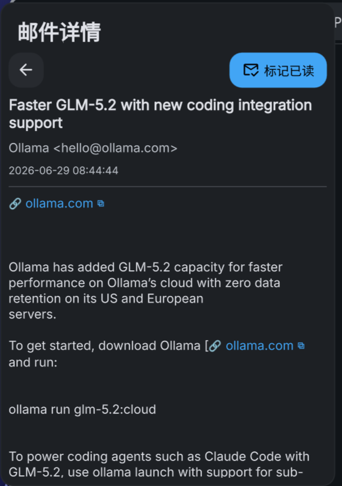
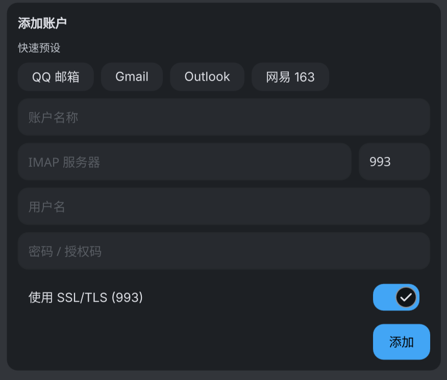

# DMS Email Client

DMS Email Client 是一个为 **DankMaterialShell (DMS)** 桌面环境量身定制的高性能邮件检查与通知插件。它采用 **Rust** 编写高性能后台守护进程，并结合 **QML (Quickshell)** 编写现代化的桌面小部件（Widget）和配置面板。

## 预览

<table>
  <tr>
    <td align="center" width="50%">
      <br>
      <sub>下拉面板：账户分类筛选、垃圾邮件标签、已读/未读区分</sub>
    </td>
    <td align="center" width="50%">
      <br>
      <sub>邮件详情：链接渲染为「🔗 域名 ⧉」可点击打开/复制，可选中复制，一键标记已读</sub>
    </td>
  </tr>
  <tr>
    <td align="center" colspan="2">
      <br>
      <sub>设置面板：常见服务商预设（QQ / Gmail / Outlook / 网易 163）、账户管理</sub>
    </td>
  </tr>
</table>

## 核心特性

- **高性能 Rust 后端**：
  - 采用基于事件驱动的 IMAP IDLE（推送通知）长连接，实时监听新邮件，资源占用极低。
  - **零轮询实时推送**：前端通过长连接订阅守护进程状态，新邮件 / 已读变化由守护进程主动推送到界面（不再定时轮询），端到端近乎零延迟；空闲时几乎不产生唤醒。
  - IDLE 唤醒时增量同步（只取新邮件头部 + 已有邮件的已读标志），并做了内存收敛（限制 malloc arena、同步后归还堆页），空闲常驻内存精简。
  - 支持多账户并发监听（不同账户运行在独立的后台线程中）。
  - 内置垃圾邮件文件夹（Spam/Junk）智能识别，可配置监控文件夹。
  - 支持通过系统通知服务（D-Bus）发送新邮件桌面提醒。
  - 提供本地正文磁盘缓存，阅读已下载邮件时零网络延迟；缓存文件数有上限，超出按最旧淘汰，不会无限增长。
  - 支持配置文件变动监控与热重载（inotify，空闲零轮询）。
  - **健壮的兜底**：连接建立与稳态读写均有超时（半死的 TCP/代理下会报错重连而非永久卡死，超时可配），断线自动重连；账户线程即使内部 panic 也会自愈重启；本地翻译模型下载带完整性校验与重试。
- **IPC 通信**：
  - 后端守护进程与前端 QML 之间通过 Unix Socket 进行轻量级、低延迟的 JSON 数据交互。socket 位于 `$XDG_RUNTIME_DIR/dms-email-client.sock`（每用户私有；该环境变量缺失时回退到系统临时目录并以用户名区分）。
- **DMS QML 插件**：
  - **状态栏小部件**：支持水平和垂直状态栏模式下的 Pill 小部件展示，包含邮件图标、未读计数徽章以及错误状态气泡。
  - **下拉面板**：点击图标展示邮件列表下拉面板，支持快速浏览未读邮件、查看邮件发送人、主题及日期。
  - **内置阅读器**：点击邮件在下拉面板中直接查看正文（HTML 自动转纯文本）。正文中的链接渲染为「🔗 域名」可点击打开、附「⧉」一键复制完整链接；验证码（独立 4–8 位数字）可点击复制；正文支持鼠标选中复制。
  - **已读管理**：单封「标记已读」与整箱「一键已读」；已读邮件保留在列表中（仅去掉未读红点并暗化显示），未读邮件以红点标记。
  - **正文翻译**：详情页一键切换「原文 / 译文」，可选 Google（默认）/ DeepLX / 本地离线 NLLB 三种引擎，URL 与验证码保持原样。详见下文「翻译」一节。
  - **配置面板**：内置账户管理界面，提供 QQ 邮箱、Gmail、Outlook、网易 163 等常见 IMAP 服务商配置预设，支持调整缓存上限、下拉面板高度、翻译引擎/语言等（新邮件由守护进程实时推送，无需配置刷新间隔）。

---

## 项目结构

```text
├── Cargo.toml                  # Rust 项目依赖配置
├── Cargo.lock
├── src/                        # 后端守护进程与 CLI 源码（按职责分模块）
│   ├── main.rs                 # 命令行解析（clap）；把子命令映射成 IPC 请求发给守护进程
│   ├── config.rs               # 配置文件 (config.toml) 加载与持久化
│   ├── ipc.rs                  # IPC 通信：socket 路径 + 请求协议(编码/解析) + 客户端收发
│   ├── segment.rs              # 正文切分器：把纯文本切成 [散文 | URL | 验证码] 有序片段（渲染与翻译共用）
│   ├── mailhtml.rs             # 邮件正文 → 可读文本 / 可渲染 HTML（URL/验证码可点击）
│   ├── sysmem.rs               # glibc 内存调优（arena 上限 / 归还空闲堆页）
│   ├── translate.rs            # 翻译引擎（Google / DeepLX / 本地 NLLB）、模型懒加载卸载与译文缓存
│   └── daemon/                 # 守护进程
│       ├── mod.rs              # 编排：启动账户线程/配置监视器、监听 socket、按请求分发
│       ├── state.rs            # 共享状态（未读列表/账户错误）+ 状态变更广播（watch 零延迟推送）
│       ├── imap_sync.rs        # 每账户 IMAP 连接 + 检查循环 + IDLE + 文件夹探测 + 增量头部缓存
│       └── commands.rs         # 按需命令：取正文 / 翻译 / 标记已读 / 批量已读
├── dmsEmailClient/             # DMS 前端插件目录（QML）
│   ├── plugin.json             # DMS 插件清单描述文件
│   ├── DmsEmailClientWidget.qml   # 状态栏小部件、下拉面板及 IPC 交互实现
│   └── DmsEmailClientSettings.qml # 插件设置面板 UI 界面
├── docs/                       # 文档资源（README 截图等）
└── target/                     # Rust 编译输出目录
```

---

## 配置文件说明

插件配置采用 TOML 格式，默认存储在 `~/.config/dms-email-client/config.toml`。首次运行或配置文件丢失时，后端会自动创建一份包含 QQ 邮箱示例的默认配置文件：

```toml
# 邮件列表容量：守护进程为每个账户追踪的最近邮件数（仅表头），决定列表最多能有多少封。
# 0 表示不限制；会在所有启用的账户间平均分配。与磁盘正文缓存无关。
cache_limit = 50

# 正文缓存目录：打开过的邮件正文全文的磁盘缓存目录
# （留空则自动使用 $XDG_CACHE_HOME/dms-email-client，即 ~/.cache/dms-email-client）
cache_dir = ""

# 正文缓存上限：cache_dir 里最多保留多少个正文文件，超过按修改时间删最旧的（0 = 不限制）。
# 防止磁盘缓存无上限增长。
body_cache_limit = 500

# IMAP 读/写超时（秒，最小 5）。取头部/正文/标记已读等稳态操作超过此值即报错重连，
# 避免半死的 TCP（NAT/代理静默丢连）把账户线程或取信请求永久卡住。
# 不影响后台常驻等待新邮件（IDLE 有独立的 5 分钟超时）。
imap_timeout_secs = 60

[[accounts]]
name = "QQ Mail"
host = "imap.qq.com"
port = 993
username = "your_email@qq.com"
password = "your_imap_authorization_code" # 多数邮箱需要独立的授权码而非账户登录密码
ssl = true
enabled = true
```

---

## 编译与安装

### 快速安装（推荐）

克隆仓库后运行安装脚本。它默认从 GitHub 最新 Release **下载预编译二进制**（无需 Rust/cmake），
并把插件文件复制到 DMS 插件目录：

```bash
git clone https://github.com/Gm-aaa/dms-email-client.git
cd dms-email-client
./install.sh
```

- 二进制安装到 `~/.local/bin/dms-email-client`（请确保它在 `PATH` 中）；
- 插件复制到 `~/.local/share/dms/plugins/dmsEmailClient/`。

安装位置可用环境变量覆盖，例如 `DMS_EMAIL_BIN_DIR`、`DMS_EMAIL_PLUGIN_DIR`（详见 `./install.sh --help`）。

装好后在 DankMaterialShell 中启用 **DMS Email Client** 插件即可（守护进程随插件启用自动启动）。

**卸载**：

```bash
./uninstall.sh            # 移除二进制与插件（保留配置/缓存）
./uninstall.sh --purge    # 另外删除配置、正文缓存、离线翻译模型
```

### 从源码编译安装

若没有对应平台的 Release，或想自行编译，给安装脚本加 `--build`（需 **Rust 工具链** +
**C++ 工具链与 `cmake`**，因为 `ct2rs` 会在构建时从源码编译内置的 CTranslate2，首次构建较慢）：

```bash
./install.sh --build
```

也可以手动编译、自行放置：

```bash
cargo build --release          # 产物在 target/release/dms-email-client
install -Dm755 target/release/dms-email-client ~/.local/bin/dms-email-client
cp dmsEmailClient/plugin.json dmsEmailClient/*.qml ~/.local/share/dms/plugins/dmsEmailClient/
```

> 若不想把二进制放进 `PATH`，可把 `DmsEmailClientWidget.qml` 与 `DmsEmailClientSettings.qml`
> 顶部的 `binPath` 改为二进制的绝对路径。

---

## 翻译

在邮件详情页可一键将正文在「原文 / 翻译」之间切换（仅正文本身，不含主题、发件人或列表摘要）。支持三种可切换的翻译引擎。

### 引擎选择

| 引擎 | 速度 | 质量 | 隐私 / 联网 |
|---|---|---|---|
| **Google 翻译**（默认） | 秒级 | 高 | 正文发送到 Google，需联网 |
| **DeepLX**（自托管） | 秒级 | 高 | 正文发送到你配置的 DeepLX，需联网 |
| **本地 NLLB**（离线） | CPU 上较慢（随长度 ~数秒到十几秒） | 中 | 完全离线、正文不出本机 |

在线引擎（Google/DeepLX）快且质量好，但正文会离开本机；本地 NLLB 完全离线、隐私，作为保底。同一封邮件、同一引擎/语言的译文会在内存中缓存，重复查看几乎瞬时返回（缓存不落盘，守护进程重启即清）。

### 首次使用

1. 在设置面板的「翻译设置」中打开「启用翻译」开关后，详情页才会出现「翻译」按钮。
2. 选择「翻译引擎」（默认 Google，开箱即用）。选 **DeepLX** 时需在「DeepLX 地址」填入你的接口地址；选 **本地 NLLB** 时，第一次翻译会自动联网从 HuggingFace 下载约 600MB 模型到 `~/.local/share/dms-email-client/models/nllb-200-distilled-600M/`（仅首次需联网，之后完全离线）。

### 设置项

- **启用翻译**：开关，默认关闭。
- **翻译引擎**：Google（默认）/ DeepLX / 本地 NLLB。
- **DeepLX 地址**：仅引擎选 DeepLX 时使用，填完整 translate 接口地址（key 可放路径里）。
- **源语言**：默认「自动检测」（在线引擎天然支持自动检测）。
- **目标语言**：默认「简体中文」，可选英语、日语等。

### 内存占用说明

模型仅在实际发起翻译时按需加载；空闲 5 分钟后会自动从内存中卸载并释放资源，因此不使用翻译功能时守护进程依旧保持原有的低内存占用。

### 从源码编译的额外要求

普通用户使用预编译二进制运行本插件**无需安装任何额外的系统库**。但如果你选择从源码自行编译，由于 `ct2rs` 会在构建时编译内置的 CTranslate2，需要额外安装 **C++ 编译工具链**（如 `gcc`/`g++`）和 **`cmake`**；由于要从源码构建 CTranslate2，编译耗时会明显更长（尤其是首次全新构建）。

---

## 命令行与 IPC 协议

`dms-email-client` 既是后台守护进程，也是前端与守护进程交互的 CLI 工具。它支持以下命令行参数：

- **启动守护进程**：
  ```bash
  dms-email-client daemon
  ```
- **查询当前未读邮件列表（JSON 格式）**：
  ```bash
  dms-email-client status
  ```
- **获取单封邮件正文**：
  ```bash
  dms-email-client body <account> <folder> <uid>
  ```
- **翻译单封邮件正文**（`src`/`tgt` 为语言代码，`src` 传 `auto` 表示自动检测；`engine` 为 `google`(默认) / `deeplx` / `nllb`；`deeplx_url` 仅 DeepLX 引擎需要）：
  ```bash
  dms-email-client translate <account> <folder> <uid> <src> <tgt> [engine] [deeplx_url]
  ```
- **标记单封邮件为已读**：
  ```bash
  dms-email-client read <account> <folder> <uid>
  ```
- **一键标记全部为已读**（省略 account 则所有账户）：
  ```bash
  dms-email-client read-all [account]
  ```
- **展示当前配置（JSON 格式）**：
  ```bash
  dms-email-client config show
  ```
- **导入并保存配置（通过标准输入接收 JSON）**：
  ```bash
  echo '{"cache_limit":50,"cache_dir":"...","body_cache_limit":500,"imap_timeout_secs":60,"accounts":[]}' | dms-email-client config save
  ```

### IPC 协议指令
向 socket（`$XDG_RUNTIME_DIR/dms-email-client.sock`）发送以 `\t` 分隔的纯文本指令，以 `\n` 结尾：
- `status` -> 返回全局状态 JSON（含已读/未读邮件，每封带 `seen` 字段）。
- `body\t<account>\t<folder>\t<uid>` -> 返回指定邮件的正文 JSON（正文为可渲染 HTML），并写入本地磁盘缓存。
- `translate\t<account>\t<folder>\t<uid>\t<src>\t<tgt>\t<engine>\t<deeplx_url>` -> 返回该邮件正文的翻译结果 JSON（`src` 为 `auto` 时自动检测源语言；`engine` 为 `google`/`deeplx`/`nllb`，`deeplx_url` 仅 DeepLX 用）。翻译结果仅缓存于内存（守护进程重启后失效），不写入磁盘缓存。为兼容旧前端，省略末两个字段的 6 字段形式仍可用（默认走本地 NLLB）。
- `read\t<account>\t<folder>\t<uid>` -> 标记为已读，将该邮件的 `seen` 置为 true（仍保留在列表中），返回 `{"ok":true}`。
- `read_all\t<account>` -> 标记该账户（account 为空则所有账户）当前全部未读为已读，返回 `{"ok":true,"marked":N}`。
- `reload` / `shutdown` -> 关闭守护进程。

---

## 版本与更新日志

所有值得注意的改动记录在 [CHANGELOG.md](CHANGELOG.md)（[Keep a Changelog](https://keepachangelog.com/zh-CN/1.1.0/) 格式，
[语义化版本](https://semver.org/lang/zh-CN/)）。`Cargo.toml`、`plugin.json` 与发布 tag 三者版本保持一致。

## 发布流程

发布由 GitHub Actions 自动完成（见 [`.github/workflows/release.yml`](.github/workflows/release.yml)）。维护者发版步骤：

1. 在 `CHANGELOG.md` 顶部把 `## [Unreleased]` 下的改动整理进新版本段落，例如 `## [0.3.0] - YYYY-MM-DD`；
2. 同步更新 `Cargo.toml` 与 `dmsEmailClient/plugin.json` 的 `version`（三者一致），并 `cargo build` 刷新 `Cargo.lock`；
3. 提交后打 tag 并推送：

   ```bash
   git tag v0.3.0
   git push origin v0.3.0
   ```

4. 工作流会在 `ubuntu-22.04` 上编译，产出 `dms-email-client-x86_64-linux`，并以该 tag 创建 Release，
   Release 说明自动取自 CHANGELOG 中对应版本段落。

> 预编译二进制面向 x86_64 Linux（glibc，基于 ubuntu-22.04 构建以兼顾较旧系统），动态链接系统 OpenSSL。
> 使用 musl 或过旧 glibc 的系统请改用 `./install.sh --build` 从源码编译。

## 许可证

[MIT License](LICENSE)
